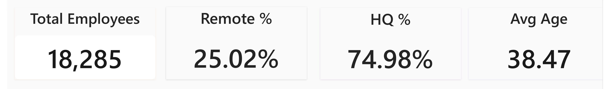

# 👥 HR Analytics: Workforce Profile, Diversity & Hiring Dashboard

> End-to-end analysis of **22,214 employee records (18,285 active)** using
> **MySQL, Power BI and Excel**, covering workforce KPIs, hiring trends, diversity,
> department structure and geographic concentration, with actionable recommendations.

---

## 🎯 Business Problem
HR leadership needs one clear view of **who works at the company, where, and how
hiring has evolved**, so it can plan recruiting, monitor diversity and spot
business-continuity risks early.

**Questions answered**
- How large is the active workforce and what is its profile (age, remote vs HQ)?
- How has hiring changed year by year?
- How are employees distributed across departments, states, gender and race?
- Where are the biggest risks and what should HR do about them?

---

## 🛠️ Tools & Skills
| Area | Tools |
|---|---|
| Data storage and filtering | MySQL (SQL) |
| Dashboard and visualisation | Power BI Desktop |
| Data handling | Excel |
| Reporting | PDF report, PowerPoint presentation |

**Skills shown:** data cleaning, SQL filtering, KPI design, dashboard building,
data storytelling, business recommendations.

---

## 🔄 Approach
1. **Loaded** 22,214 employee records (`HR_data.xlsx`)
2. **Defined active employees** with SQL: records with no termination date
3. **Calculated KPIs:** headcount, average age, remote vs HQ share
4. **Built a Power BI dashboard:** hiring trend, department, state, gender and race
5. **Wrote the report and presentation** with insights, recommendations and limitations

---

## 📊 Key KPIs
| Metric | Value |
|---|---|
| Total records (ever hired) | **22,214** |
| Active employees | **18,285** |
| Working at HQ | **74.98%** |
| Working remotely | **25.02%** |
| Average age | **38.47 years** |

---

## 🔍 Key Insights

**📈 Hiring:** Steady hiring of **~1,050-1,150 employees per year from 2001 to
2019**, with no growth or contraction phase. 2020 dipped to 1,012, plausibly a
pandemic effect. The business is in a mature, replacement-driven phase.

**⚖️ Gender:** Close to balanced: **Male 50.81% (9,328), Female 46.46% (8,455),
Non-Conforming 2.72% (502)**.

**🌍 Race:** No single group holds a majority. White is the largest at 28.5%,
followed by Two or More Races and Black or African American (16.3% each) and
Asian (16.1%).

**🏢 Departments:** **Engineering is the largest (5,501, about 1 in 3 employees)**,
followed by Accounting (2,747), Human Resources (1,498) and Sales (1,497). The
smallest are **Auditing (40) and Legal (248)**.

**📍 Geography:** **Ohio holds 14,788 of 18,285 active employees (~81%)**. Every
other state is under 6%, a clear **concentration risk**.

---

## ✅ Recommendations
1. **Reduce geographic concentration risk:** expand remote or secondary-location
   hiring to lessen dependence on Ohio.
2. **Track gender and race balance regularly,** including inside departments and
   senior roles, to catch drift early.
3. **Review staffing depth in Legal and Auditing** to ensure compliance-critical
   coverage.
4. **Plan recruiting for steady-state hiring (~1,100/year),** not high growth.

---

## ⚠️ Data Notes & Limitations
- "Active" means no termination date (NULL or blank).
- The data has **future-dated termination dates** (e.g. 2029). These were treated as

---

## How to Use

1. **Clone the Repository**: Clone this project repository from GitHub.
2. **Set Up the Database**: Run the SQL scripts provided in the `database_setup.sql` file to create and populate the database.
3. **Run the Queries**: Use the SQL queries provided in the `analysis_queries.sql` file to perform your analysis.
4. **Explore and Modify**: Feel free to modify the queries to explore different aspects of the dataset or answer additional business questions.

---

## Author - Kavin

This project is part of my portfolio, showcasing the SQL skills essential for data analyst roles. If you have any questions, feedback, or would like to collaborate, feel free to get in touch!

---

- **LinkedIn**: [Connect with me professionally](https://www.linkedin.com/in/kavin-v-661b05285/)
- **Email** : [Connect with me professionally](kavin62405@gmail.com)

Thank you for your support, and I look forward to connecting with you!
